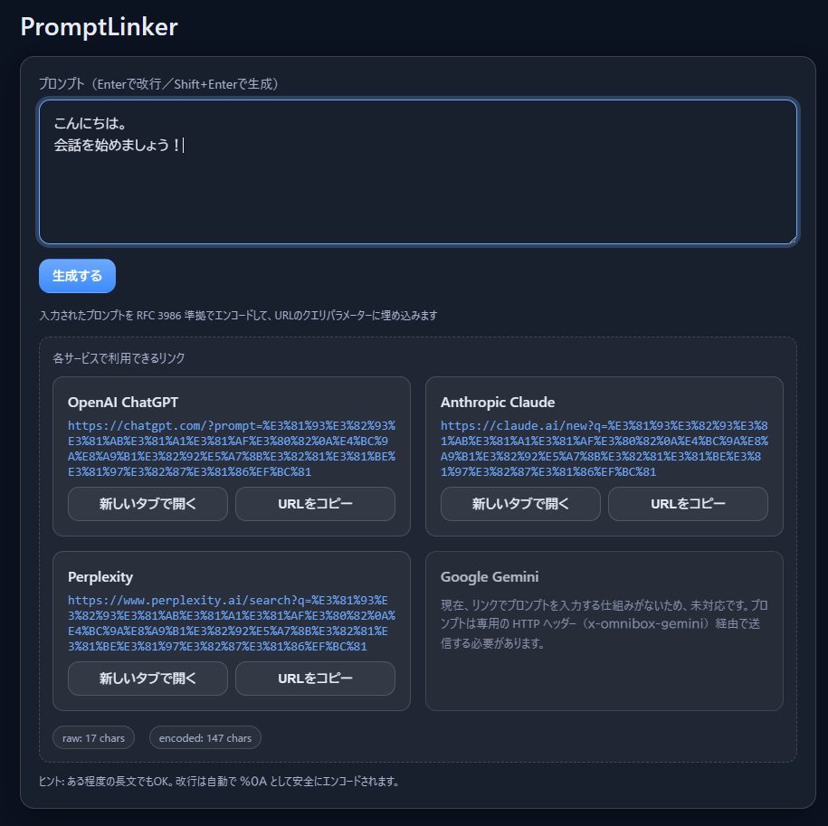

# PromptLinker

PromptLinker は、入力した文章を **RFC 3986 準拠** でエンコードし、OpenAI ChatGPT / Claude / Perplexity 向けのリンクを同時に生成する Web アプリです。
Google Gemini については、リンク経由でプロンプトを渡せないため、対応していません。GitHub Pages 上にデプロイすれば、そのままブラウザから利用できます。

👉 **デモはこちら**: [https://isshiki.github.io/chatgpt-url-generator/](https://isshiki.github.io/chatgpt-url-generator/)

---

## 特徴

- OpenAI ChatGPT / Claude / Perplexity 向けのリンクを同時生成
- 各サービスごとに **新しいタブで開く / URL をコピー** できる操作ボタンを用意
- RFC 3986 準拠のエンコード（`A-Z a-z 0-9 - . _ ~` のみ非エンコード）
- 改行対応（`%0A` として安全にエンコード）
- Enter で改行、**Shift+Enter** で生成（Ctrl+Enter も利用可）
- 生成された URL を **クリック / 新規タブで開く / コピー** 可能
- 完全クライアントサイド、サーバ不要

---

## 使い方

1. テキストエリアにプロンプトを入力します  
   （例：「こんにちは、ブログの導入文を3案ください」など）
2. **Shift+Enter** または「生成する」ボタンで URL を生成
3. 下部に表示された各サービスのリンクをクリック、コピー、または新しいタブで開いて利用できます

---

## Google Gemini について

Gemini では、リンクのクエリパラメーターでプロンプトを渡す仕組みが現状用意されていません。
そのため、本アプリでは「現在、リンクでプロンプトを入力する仕組みがないため、未対応です。」という案内のみを表示しています。
プロンプトを送るには `https://gemini.google.com/prompt?utm_source=chrome_omnibox&utm_medium=owned&utm_campaign=gemini_shortcut` に対して POST リクエストを送り、`x-omnibox-gemini` といった専用の HTTP ヘッダーを付与する必要があるため、将来的な公式対応をお待ちください。

---

## デプロイ方法（GitHub Pages）

1. 本リポジトリを fork または clone  
2. `index.html` をリポジトリ直下に配置（すでに含まれています）
3. GitHub のリポジトリ設定 → **Settings → Pages** で  
   **Branch: main / root** を選択して保存
4. 数十秒後、`https://<ユーザー名>.github.io/<リポジトリ名>/` で公開されます

---

## サンプル画面

---

## ライセンス

このプロジェクトは [Apache License 2.0](LICENSE) の下で公開されています。  

